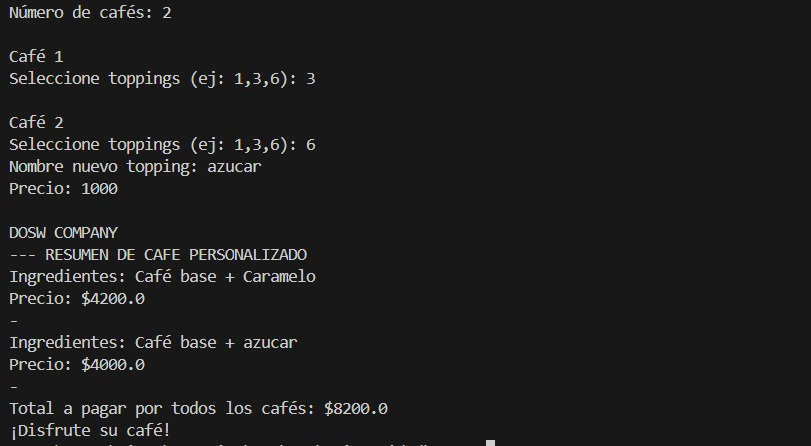

# DOSW Lab 2 - Reto 5

## Integrantes
- Gina Sofia Garcia Zapata
- Juan Diego Patino Munoz

**Patrón de Diseño**
Estructural

**Patrón Utilizado**
Decorator (Decorador)

**Justificación**
Se eligió este patrón porque permite añadir responsabilidades (toppings y precios) a un objeto individual (el café) de forma dinámica y transparente, sin afectar a otros objetos de la misma clase ni modificar el código de la clase CafeBase. Es la solución perfecta para cumplir con el principio de Abierto/Cerrado (Open/Closed Principle): el sistema está abierto a la extensión (nuevos toppings) pero cerrado a la modificación de la base.

**Cómo lo aplico**
Componente: Se definio una interfaz Cafe que establece los métodos base getPrecio() y getDescripcion().

Decorador: Se creo una clase abstracta ToppingDecorator que contiene una referencia a un objeto Cafe.

Implementación: Cada vez que el usuario selecciona un topping, el objeto Cafe existente se "envuelve" en un nuevo ToppingConcreto. Este nuevo objeto suma su propio precio al precio del café que tiene dentro, logrando así una estructura de cebolla o capas donde el café final es la suma de todas sus envolturas.

